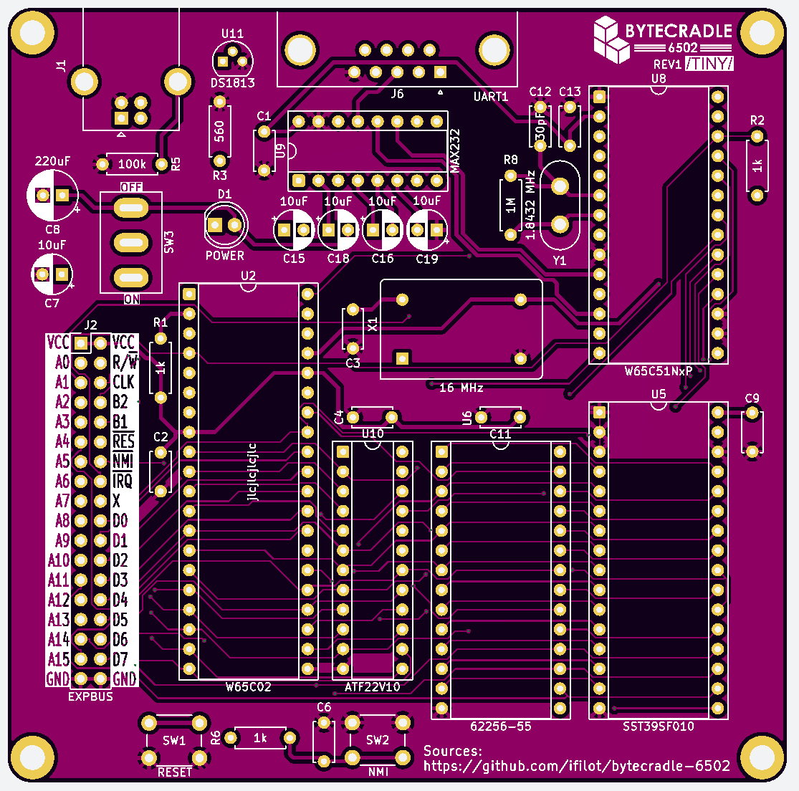
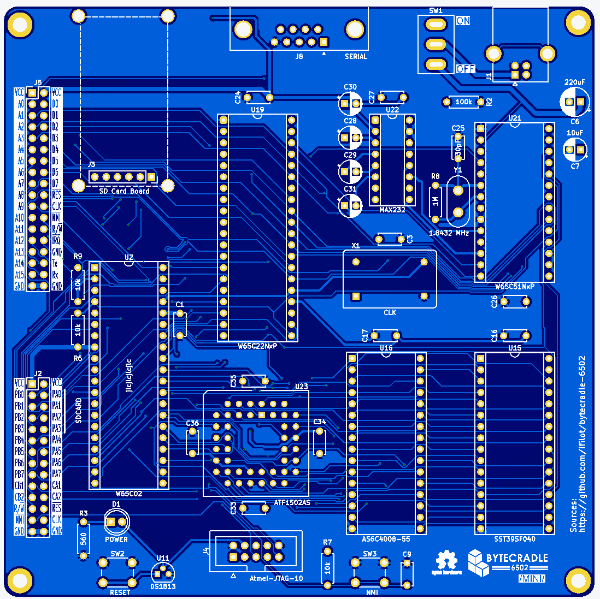

# BYTECRADLE 6502

> [!tip]
> Detailed documentation on the ByteCradle 6502 can be found 
> [here](https://ifilot.github.io/bytecradle-6502/).

The **ByteCradle 6502** is a **single-board computer (SBC)** platform designed
for understanding and experimenting with **simple operating systems** on **8-bit
hardware**. Built around the **WDC 65C02** microprocessor, it provides a
hands-on platform for studying **system initialization, memory management,
device interfacing, and file system handling**.  

## Tier-system

This project offers two tiers of single board computers (SBCs), each tailored to
different levels of complexity and expandability:

- **Tiny SBC** (left): A simple, compact design ideal for learning or small
  embedded projects.
- **Mini SBC** (right): A more capable version with bank switching and SD card
  storage, perfect for more ambitious retro computing tasks.

  
  

## Overview

Both SBCs share a common design philosophy — to provide a straightforward and
accessible 65C02 system, while exploring different levels of hardware
capability.

### Shared Components

- **CPU**: WDC 65C02
- **I/O**: WDC 65C51 Asynchronous Communications Interface Adapter (ACIA)

## Tier Comparison

| Feature              | Tiny SBC                          | Mini SBC                             |
|----------------------|-----------------------------------|--------------------------------------|
| **RAM**              | 32 KiB                            | 512 KiB (bank switched)              |
| **ROM**              | 32 KiB                            | 512 KiB (bank switched)              |
| **Bank Switching**   | ❌                               | ✅ (64 x 8 Kib banks)                |
| **SD Card Support**  | ❌                               | ✅ (via WDC 65C22 VIA)               |
| **I/O Interface**    | WDC 65C51 ACIA                    | WDC 65C51 ACIA                       |
| **Expansion Options**| Exposes system bus                | Exposes system bus and VIA bus       |

## About the Mini SBC

The Mini SBC expands significantly on the Tiny version by incorporating a large
memory map through bank switching and adding persistent storage with an SD card
interface. It uses the versatile 65C22 VIA for managing SD card communication
and possibly other peripherals in future expansions.

## License

### Software
All software (including ROM code, tools, and firmware) in this repository is
licensed under the [GNU General Public License v3.0](LICENSE-GPL).

This means:
- You are free to use, modify, and share the software.
- If you distribute modified versions, you must also release them under the GPLv3.

### Hardware
All hardware design files (schematics, PCB layouts, bills of materials, etc.)
are licensed under the [CERN Open Hardware License v2 - Weakly Reciprocal
(CERN-OHL-W)](LICENSE-HARDWARE).

This means:
- You may study, modify, manufacture, and distribute the hardware freely.
- If you distribute a modified version, you must share your changes under the
  same license.

## Contributing

Contributions, ideas, and improvements are always welcome. Open an issue or
submit a pull request to get involved!