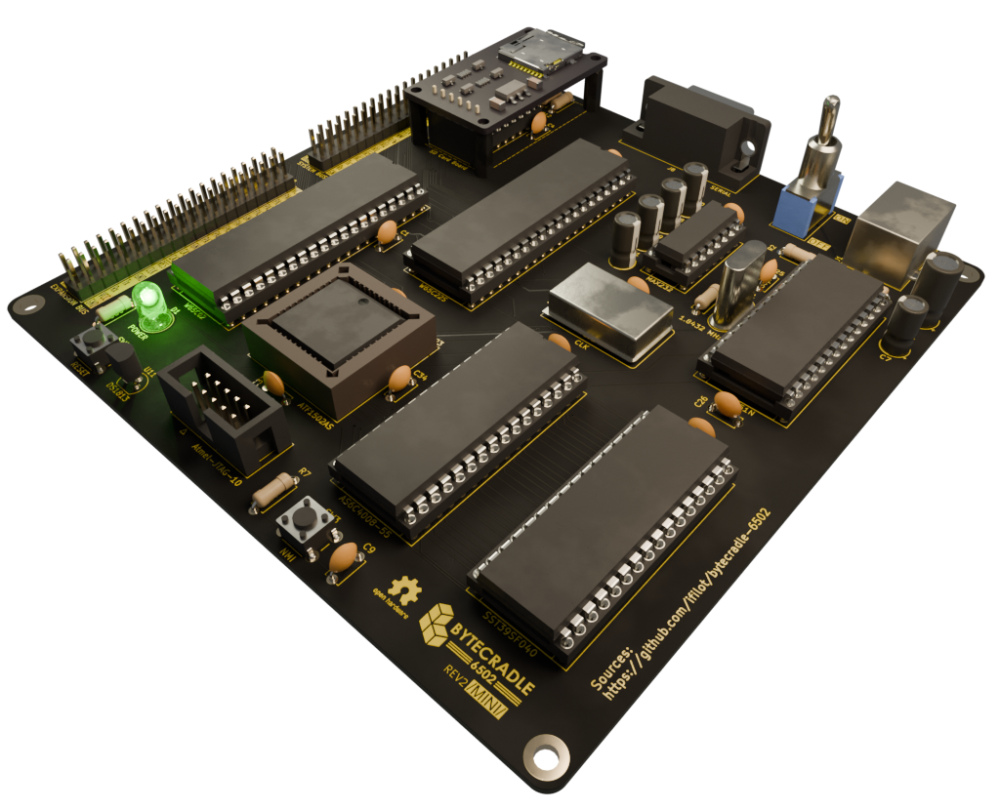
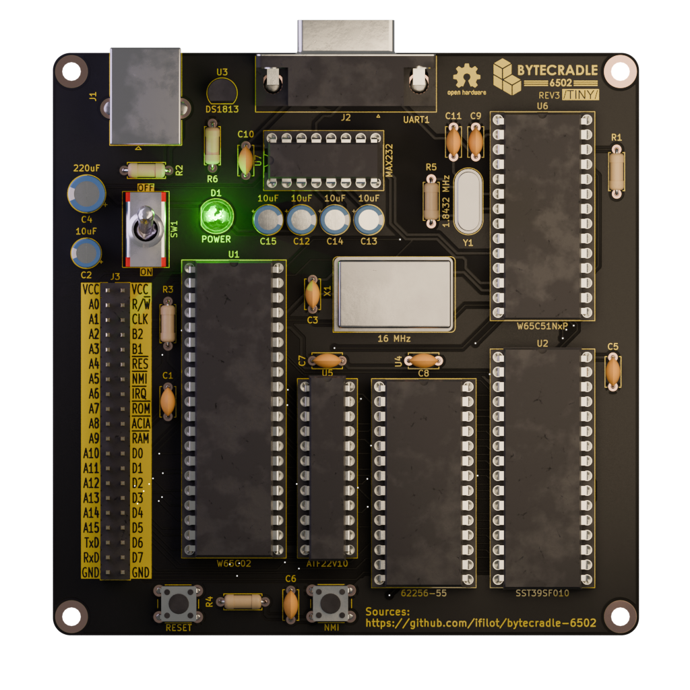
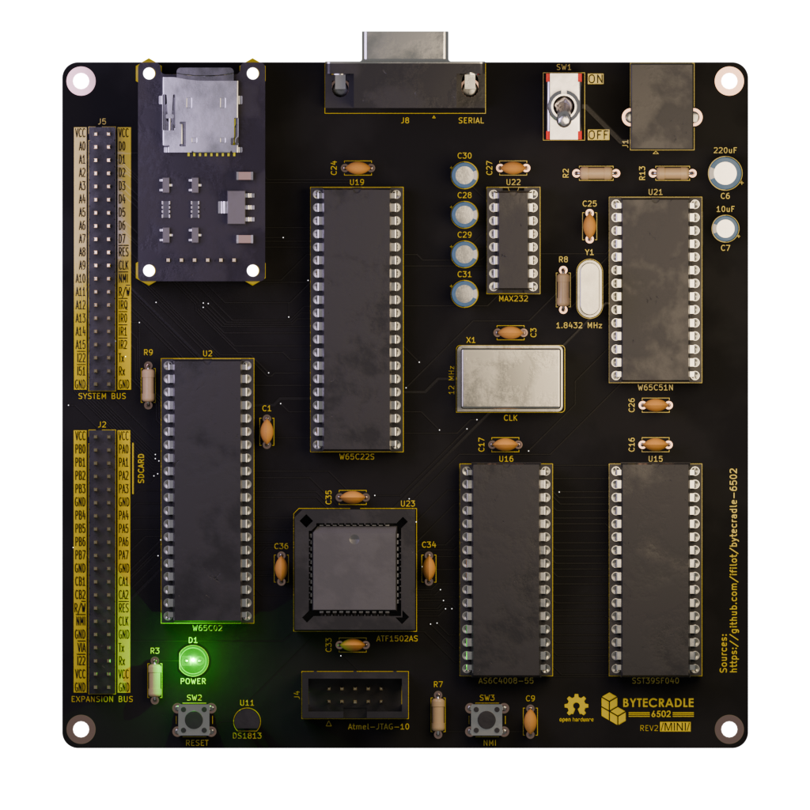

# ByteCradle 6502

The **ByteCradle 6502** is a **single-board computer (SBC)** platform designed
for understanding and experimenting with **simple operating systems** on **8-bit
hardware**. Built around the **WDC 65C02** microprocessor, it provides a
hands-on platform for studying **system initialization, memory management,
device interfacing, and file system handling**.

## 📋 Table of Contents

- [BYTECRADLE 6502](#bytecradle-6502)
- [Overview](#overview)
  - [Shared Components](#shared-components)
- [Tier Comparison](#tier-comparison)
- [Obtaining PCBs](#obtaining-pcbs)
- [Download ROMs](#download-roms)
- [License](#license)
  - [Software](#software)
  - [Hardware](#hardware)
- [Contributing](#contributing)
- [Acknowledgements](#acknowledgements)

## Overview

Both SBCs share a common design philosophy — to provide a straightforward and
accessible 65C02 system, while exploring different levels of hardware
capability.

### Shared Components

- **CPU**: WDC 65C02
- **I/O**: WDC 65C51 Asynchronous Communications Interface Adapter (ACIA)

## Tier Comparison

This project offers two tiers of single board computers (SBCs), each tailored to
different levels of complexity and expandability:

- **Tiny SBC** (top): A simple, compact design ideal for learning or small
  embedded projects.
- **Mini SBC** (bottom): A more capable version with bank switching, SD card
  storage, and an expansion bus using the 65C22 Versatile Interface Adapter
  (VIA).

| Feature              | Tiny SBC                          | Mini SBC                             |
|----------------------|-----------------------------------|--------------------------------------|
| **PCB**              | Two layer                         | Four layer                           |
| **RAM**              | 32 KiB                            | 512 KiB (bank switched)              |
| **ROM**              | 32 KiB                            | 512 KiB (bank switched)              |
| **Bank Switching**   | ❌                               | ✅ (64 x 8 Kib banks)                |
| **SD Card Support**  | ❌                               | ✅ (via WDC 65C22 VIA)               |
| **I/O Interface**    | WDC 65C51 ACIA                    | WDC 65C51 ACIA                       |
| **Expansion Options**| Exposes system bus                | Exposes system bus and VIA bus       |

## Obtaining PCBs

You can have the ByteCradle PCBs manufactured at any PCB fabrication service of
your choice. However, for convenience and ease of ordering, we recommend using
[PCBWay](https://www.pcbway.com).

The following links will take you directly to the shared projects on PCBWay, where you can order the boards:

- [Order the Mini Board from PCBWay](https://www.pcbway.com/project/shareproject/ByteCradle_6502_Mini_Board_becc5f96.html)
- [Order the Tiny Board from PCBWay](https://www.pcbway.com/project/shareproject/ByteCradle_6502_Tiny_Board_7606b02a.html)

> [!NOTE]  
> These links direct you to the official project pages for the Mini and Tiny
> Boards on PCBWay.

## Download ROMs

Below are the available ROM images for use with the ByteCradle single-board
computers. These ROMs can be flashed onto your device depending on the board you
are using.

- **[TinyROM](https://github.com/ifilot/bytecradle-6502/releases/download/tinyrom-latest/tinyrom.bin)**  
  A lightweight ROM designed specifically for the Tiny Board. Ideal for minimal
  setups, testing, or basic 6502 development.

- **[ByteCradle Operating System ROM](https://github.com/ifilot/bytecradle-6502/releases/download/bcos-latest/bcos.bin)**  
  A more feature-rich ROM intended for the Mini Board. This includes support for
  SD card storage and is better suited for more complex applications and
  multitasking environments.

> [!IMPORTANT]  
> Make sure to select the appropriate ROM for your board model. Flashing the
> incorrect ROM may result in system instability.

## License

### Software

All software (including ROM code, tools, and firmware) in this repository is
licensed under the [GNU General Public License v3.0](LICENSE-GPL).

This means:
- You are free to use, modify, and share the software.
- If you distribute modified versions, you must also release them under the GPLv3.

### Hardware

All hardware design files (schematics, PCB layouts, bills of materials, etc.)
are licensed under the [CERN Open Hardware License v2 - Weakly Reciprocal
(CERN-OHL-W)](LICENSE-HARDWARE).

This means:
- You may study, modify, manufacture, and distribute the hardware freely.
- If you distribute a modified version, you must share your changes under the
  same license.

## Contributing

Contributions, ideas, and improvements are always welcome. Open an issue or
submit a pull request to get involved!

## Acknowledgements

We gratefully acknowledge [PCBWay](https://www.pcbway.com/) for their generous
support in sponsoring the prototype PCB manufacturing of the Mini Board. Their
assistance helped accelerate the development and testing of the hardware, and we
appreciate their commitment to supporting open hardware projects.